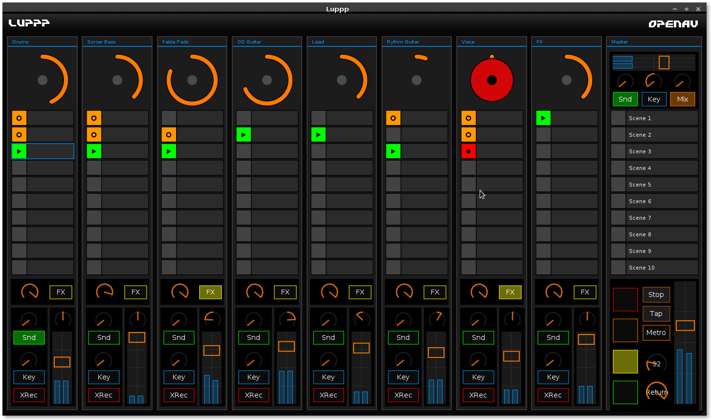

Luppp - OpenAV Productions
===============================

  * [Official web page](http://openavproductions.com/luppp)
  * [Demo videos](https://www.youtube.com/playlist?list=PLPVwzZjovbBxIik8lUisH5XdLzALDeY9j)
  * [User documentation](http://openavproductions.com/doc/luppp.html)

This is the repository of Luppp, the live looping tool.



Intro
-----
This version of Luppp is designed from zero to handle realtime
audio, and scale with additional features as needed.

This version depends on the following libraries:
please ensure the -dev versions are installed.

```bash
JACK
CAIRO
LIBLO
LIBSNDFILE
LIBSAMPLERATE
NTK  ( git clone git://git.tuxfamily.org/gitroot/non/fltk.git ntk
    or git clone https://git.kx.studio/non/ntk )

```

macOS Build (Apple Silicon / ARM64)
------------------------------------
This fork has been modernized to build and run on macOS with Apple Silicon.

### Dependencies

Install dependencies using Homebrew (ARM64 version):

```bash
/opt/homebrew/bin/brew install meson ninja jack liblo cairo libsndfile libsamplerate fltk
```

**Important**: Use `/opt/homebrew/bin/brew` (ARM64) not `/usr/local/bin/brew` (x86_64)

### Changes from Original

The following modifications were made for macOS compatibility:

1. **Replaced NTK with FLTK 1.4**: NTK (Non Toolkit) is a Linux-specific fork of FLTK with poor macOS support. We now use the modern FLTK 1.4 which has native macOS support.

2. **Cairo Integration**: Created `src/avtk/avtk_helpers.h` to bridge FLTK 1.4's drawing system with Cairo. The helper:
   - Creates Cairo image surfaces for widget rendering
   - Translates coordinates from absolute to relative
   - Converts BGRA to RGB format for FLTK
   - Handles drawing without requiring `fl_gc` to be initialized

3. **Platform-Specific Code**: Added `#ifdef __APPLE__` guards for:
   - X11-specific window icon code (not needed on macOS)
   - Font initialization before widget creation
   - Removed X11 dependency

4. **Build System**: Updated `meson.build` to:
   - Detect FLTK via `fltk-config` instead of pkg-config
   - Use correct library paths for ARM64 Homebrew
   - Remove X11 dependency on macOS

### Build Instructions for macOS

```bash
PKG_CONFIG_PATH="/opt/homebrew/lib/pkgconfig" meson setup build
cd build
ninja
./luppp
```

**Note**: Make sure JACK is running before starting Luppp.


Install
-------

Run the following commands from the top directory to configure & install Luppp:

```bash
meson build
cd build
ninja
./luppp
```


Issues
------
Please report bugs on [github.com/openAVproductions/openAV-Luppp/issues](http://github.com/openAVproductions/openAV-Luppp/issues)


Contact
-------
If you have a particular question, email me!
```
harryhaaren@gmail.com
```

Cheers, -Harry
